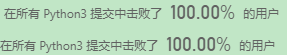

# 题目

https://leetcode-cn.com/contest/biweekly-contest-21/problems/find-the-longest-substring-containing-vowels-in-even-counts/

> 给你一个字符串 `s` ，请你返回满足以下条件的最长子字符串的长度：每个元音字母，即 'a'，'e'，'i'，'o'，'u' ，在子字符串中都恰好出现了偶数次。

# 解题思路 √

**我的LeetCode发布题解** https://leetcode-cn.com/problems/find-the-longest-substring-containing-vowels-in-even-counts/solution/python3-shuang-bai-dai-ma-yi-dong-yi-huo-zhuang-ta/



对于这个题目我们很自然能想到线性扫描一下获取**`元音字母`**出现的情况。

但是如何存储**`出现的情况`**就可以很巧妙了：

**累计出现的次数 or 出现的次数是奇是偶**

- 如果直接存储累计出现的次数，那么之后就不太方便进行比较
- 根据题意，我们比较的时候只需要同奇偶就可以了，所以我们可以通过`异或`来存储`奇偶`✅

**数组存储 or 状态压缩**

- 二维数组比较费劲，比较起来也比较麻烦
- 状态压缩：生成状态 和 数据比较都比较容易✅

这两步处理好，之后的就很简单啦！

### Python

1. 我的方法的计算结果是正确的，但是双循环暴力超时。

```python
class Solution:
    def findTheLongestSubstring(self, s: str) -> int:
        length=len(s)
        T=[[0 for i in range(5)] for i in range(length+1)]
        count=[0]*5

        for i in range(length):
            if s[i]=='a':count[0]^=1              
            elif s[i]=='e':count[1]^=1            
            elif s[i]=='i':count[2]^=1                
            elif s[i]=='o':count[3]^=1              
            elif s[i]=='u':count[4]^=1
                
            for j in range(5):
                T[i+1][j]=count[j]
            

        maxLength=0
        for i in range(length):
            target=T[i]
            for j in range(i+1,length+1):
                temp=T[j]
                if target==temp: 
                    maxLength=max(j-i,maxLength)
        
        return maxLength
```

2. 状态压缩 + 线性扫描


```python
class Solution:
    def findTheLongestSubstring(self, s: str) -> int:
        length=len(s)
        T=[0 for i in range(length+1)]
        count=0

        for i in range(length):
            if s[i]=='a':count^=1              
            elif s[i]=='e':count^=4         
            elif s[i]=='i':count^=8              
            elif s[i]=='o':count^=16            
            elif s[i]=='u':count^=32    
            T[i+1]=count
            
        maxLength=0
        for i in range(length+1):
            if T[i] in T:
                j=T.index(T[i])
                maxLength=max(i-j,maxLength)
        
        return maxLength
```


### C++

```cpp

```

---


# 整理与总结

1. 

