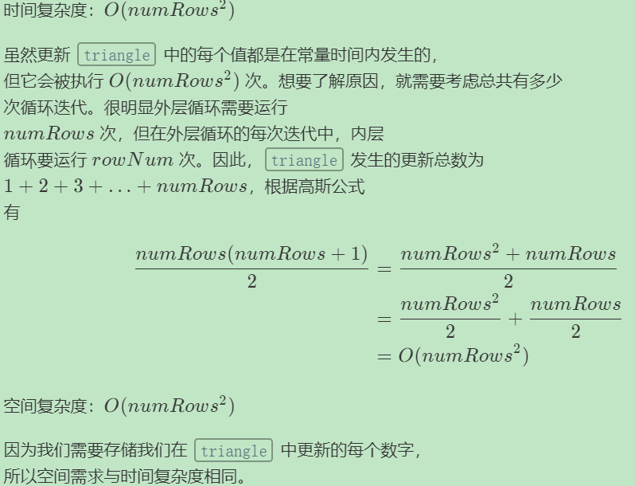

# 题目

https://leetcode-cn.com/problems/pascals-triangle/

给定一个非负整数 *numRows，*生成杨辉三角的前 *numRows* 行。


# 解题思路 √

##动态规划

原题目中的三角比较难以理解，使用比较方正的三角形方便思考位置关系。


***复杂度分析***




# Python

```python
def generate(self, numRows: int) -> List[List[int]]:
    triangle=[]

    for countRow in range(numRows):
        currRow=[None for _ in range(countRow+1)]
        currRow[0]=currRow[-1]=1

        for i in range(1,countRow):
            currRow[i]=triangle[countRow-1][i-1]+triangle[countRow-1][i]

            triangle.append(currRow)
            return triangle
```

# C++

```cpp

```

---


# 整理与总结

1. 初始化，进行动态的操作。
2. 思考出外框架，然后再丰富细节。

