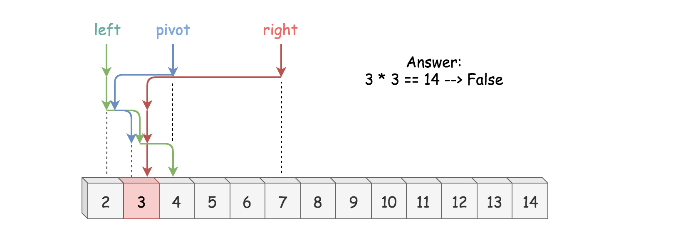
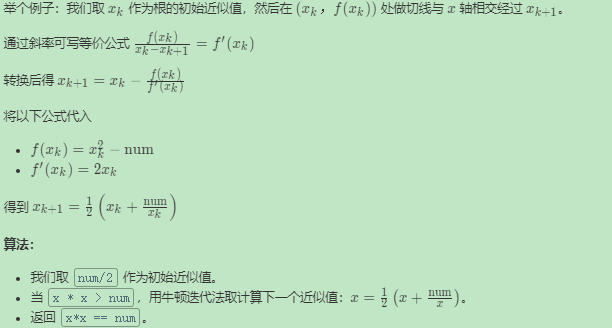

# 题目

[有效的完全平方数](https://leetcode-cn.com/problems/valid-perfect-square/)

给定一个正整数 num，编写一个函数，如果 num 是一个完全平方数，则返回 True，否则返回 False。

说明：不要使用任何内置的库函数，如  sqrt。

示例 1：

```
输入：16
输出：True
```


示例 2：

```
输入：14
输出：False
```


# 解题思路 √

平方根相关问题通常可以在对数时间内求解。这里列出了从最坏到最好的三种标准对数时间的方法：

- 递归
- 二分查找
- 牛顿迭代法

### Python

1. 二分查找
   - 若 num < 2，返回 true。
   - 设置左边界为 2，右边界为 num/2。
   - 当 left <= right：
     - 令 x = (left + right) / 2 作为一个猜测，计算 guess_squared = x * x 与 num 做比较：
       - 如果 guess_squared == num，则 num 是一个完全平方数，返回 true。
       - 如果 guess_squared > num ，设置右边界 right = x-1。
         否则设置左边界为 left = x+1。
       - 如果在循环体内没有找到，则说明 num 不是完全平方数，返回 false。



```python
class Solution:
    def isPerfectSquare(self, num: int) -> bool:
        if num < 2:
            return True
        
        left, right = 2, num // 2
        
        while left <= right:
            x = left + (right - left) // 2
            guess_squared = x * x
            if guess_squared == num:
                return True
            if guess_squared > num:
                right = x - 1
            else:
                left = x + 1
        
        return False
```

2. 牛顿迭代法

牛顿迭代法：公式是如何推导的呢？让我们做一个非常粗略的推导。

问题是找出：$f(x) = x^2 - \textrm{num} = 0$的根。

牛顿迭代法的思想是从一个初始近似值开始，然后作一系列改进的逼近根的过程。





```python
class Solution:
    def isPerfectSquare(self, num: int) -> bool:
        if num < 2:
            return True
        
        x = num // 2
        while x * x > num:
            x = (x + num // x) // 2
        return x * x == num
```

### C++

```cpp

```

---


# 整理与总结

1. 

