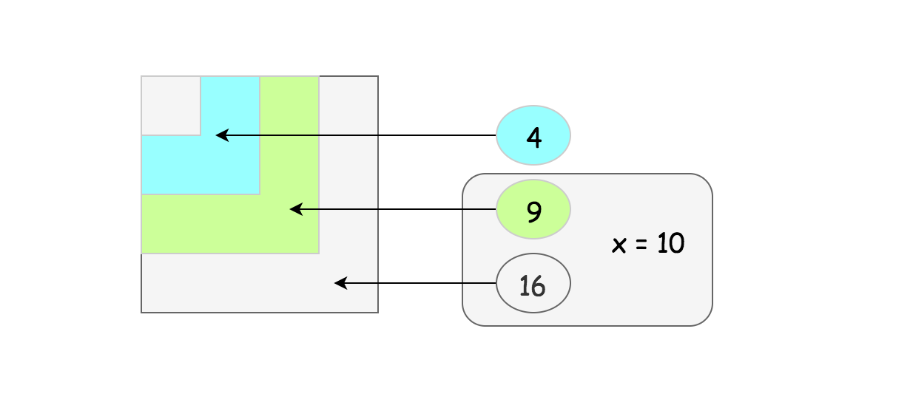
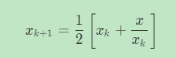

# 题目

https://leetcode-cn.com/problems/sqrtx

实现 int sqrt(int x) 函数。

计算并返回 x 的平方根，其中 x 是非负整数。

由于返回类型是整数，结果只保留整数的部分，小数部分将被舍去。

**示例 1:**

```
输入: 4
输出: 2
```


**示例 2:**

```
输入: 8
输出: 2
说明: 8 的平方根是 2.82842..., 
     由于返回类型是整数，小数部分将被舍去。
```

# 解题思路 √

### Python



1. 递归+位操作

```python
class Solution:
    def mySqrt(self, x: int) -> int:
        if x<2:return x
        left=self.mySqrt(x>>2)<<1
        right=left+1
        return left if right*right>x else right
```

2. 牛顿法

   


```python
class Solution:
    def mySqrt(self, x: int) -> int:
        if x<2:return x
        
        a=x
        b=(a+x/a)/2
        while abs(a-b)>=0.1:
            a=b
            b=(a+x/a)/2
        return int(b)
```

3. 二分查找

```python
class Solution:
    def mySqrt(self, x: int) -> int:
        if x<=1:return x
        low,high=1,x
        while low<=high:
            mid=low+(high-low)//2
            sqrt=x//mid
            if sqrt==mid:return mid
            elif mid>sqrt:high=mid-1
            else:low=mid+1
        return high
```


### C++

```cpp

```

---


# 整理与总结

1. 由比较每种方法在同一范围下的迭代次数可知，牛顿法的性能最好。

