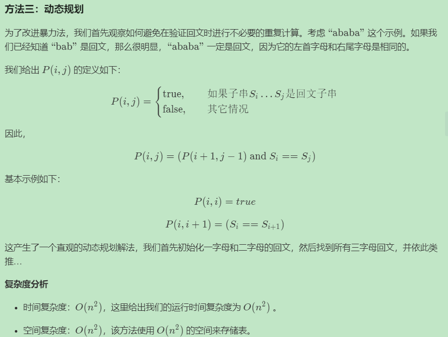

# 题目

https://leetcode-cn.com/problems/longest-palindromic-substring/

> Given a string s, find the longest palindromic substring in s. You may assume that the maximum length of s is 1000.


# 解题思路 √

### Python

1. 

```python
class Solution:
    def longestPalindrome(self, s: str) -> str:
        length=len(s)
        maxPalLength,leftIDX,rightIDX=0,0,0
        store_table=[[True]*i for i in range(1,length+1)]
        for j in range(length):
            for i in range(j+1):
                if j==i:target=True
                elif j==i+1:target=(s[i]==s[j])
                else:target=store_table[j-1][i+1] and (s[i]==s[j])
                store_table[j][i]=target
                if target: 
                    if j-i+1>maxPalLength:
                        maxPalLength=j-i+1
                        leftIDX,rightIDX=i,j
        return s[leftIDX:rightIDX+1]
```


```python

```


### C++

```cpp

```

---


# 整理与总结

1. 思路一：正序/逆序 最大公共子串 + 为了避免错位对应的情况，我们需要检查`idx`
2. 思路二：暴力法检验【开始、终止位置，然后检验】

