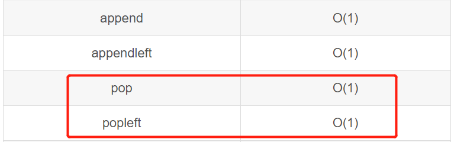

# 题目

https://leetcode-cn.com/problems/dui-lie-de-zui-da-zhi-lcof/

> 请定义一个队列并实现函数 max_value 得到队列里的最大值，要求函数max_value、push_back 和 pop_front 的时间复杂度都是O(1)。
>
> 若队列为空，pop_front 和 max_value 需要返回 -1
>

```python
# Your MaxQueue object will be instantiated and called as such:
# obj = MaxQueue()
# param_1 = obj.max_value()
# obj.push_back(value)
# param_3 = obj.pop_front()
```

# 解题思路 √

### Python

1. 暴力方法

```python
import queue
class MaxQueue:
    def __init__(self):
        self.deque=queue.deque()

    def max_value(self) -> int:
        return max(self.deque) if self.deque else -1

    def push_back(self, value: int) -> None:
        self.deque.append(value)

    def pop_front(self) -> int:
        return self.deque.popleft() if self.deque else -1
```

`max`的时候需要遍历`O(n)`。

2. 辅助队列实现`O(1)`

   辅助队列是排好序的，从大到小，找`max`的时候直接输出第一个元素就可以了。

   - 添加元素的时候，从最后往前检查，放在合适位置；并且在这个检查的过程中，删除比这个元素小的元素。那么最后剩下的就是最大的元素 一直到 这个元素。
   - 删除元素的时候，如果不是最大的元素，那么对于整体最大值没有影响。并且由于queue的顺序性质，两个queue的顺序性质是一样的，所以不会出现越级影响最大值的情况。


```python
class MaxQueue:
    def __init__(self):
        from collections import deque
        self.que=deque()
        self.sorted_que=deque()

    def max_value(self) -> int:
        return self.sorted_que[0] if self.que else -1

    def push_back(self, value: int) -> None:
        self.que.append(value)
        while self.sorted_que and self.sorted_que[-1]<value:
            self.sorted_que.pop()
        self.sorted_que.append(value)

    def pop_front(self) -> int:
        if not self.que:return -1
        ans=self.que.popleft() 
        if ans==self.sorted_que[0]:
            self.sorted_que.popleft()
        return ans
```


### C++

```cpp

```

---


# 整理与总结

1. 借这个机会整理一下队列吧。

   `Python queue.deque()`这个是从官方解答中来的，但是比较常见的是`collections`

   

   
